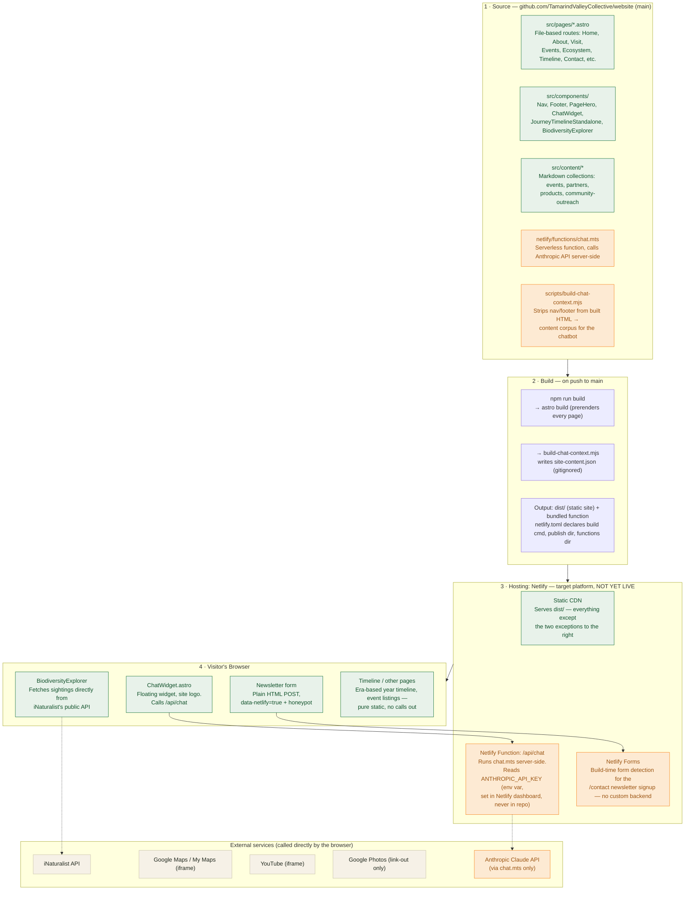

# Website Architecture

> **Keep this file up to date.** Whenever a change affects hosting, data flow, external
> services, or how a page/feature is served (new integration, new serverless function, moving
> off Netlify, etc.), update the diagram and the relevant section below in the same change.
> See the note in `AGENTS.md`.

## Overview

The site is an Astro rebuild of the original Tamarind Valley Collective website, almost
entirely static (prerendered HTML/CSS/JS, no server at request time). There are two
deliberate exceptions that need a small serverless backend: the site-wide chat assistant and
the newsletter signup form. Both are built against **Netlify**, the intended hosting
platform — see [Current Production Status](#current-production-status) before assuming any
of this is live.

## Diagram

**Legend:** 🟢 static / no server required · 🟠 depends on Netlify specifically (Functions or
Forms) · ⬜ external third-party service.

## Layer-by-layer detail

### 1. Source (GitHub)

- **`src/pages/*.astro`** — file-based routes for every page: Home, About, Visit, Events,
  Ecosystem, Timeline, Contact, and their sub-pages.
- **`src/components/`** — shared UI: Nav, Footer, PageHero, the ChatWidget, the year-by-year
  `JourneyTimelineStandalone` component, and the live `BiodiversityExplorer`.
- **`src/content/`** — Markdown content collections that change over time without touching
  code: `events`, `partners`, `products`, `community-outreach`.
- **`netlify/functions/chat.mts`** — the one serverless function, powering the chat widget.
- **`scripts/build-chat-context.mjs`** — post-build script that prepares the chat widget's
  knowledge base.

### 2. Build

On every push to `main` (once connected to hosting):

1. `astro build` — prerenders every route to static HTML into `dist/`.
2. `build-chat-context.mjs` — strips repeated Nav/Footer markup out of the built HTML and
   writes the remaining page text into a single JSON corpus (`site-content.json`, regenerated
   every build, gitignored).

`netlify.toml` declares the build command, publish directory (`dist`), and functions directory
(`netlify/functions`) so a Netlify deploy needs no manual configuration.

### 3. Hosting — Netlify (target platform)

- **Static CDN** — serves every prerendered page directly; the large majority of the site
  needs nothing more than this.
- **Netlify Function** — runs `chat.mts` server-side at `/api/chat`. Reads an
  `ANTHROPIC_API_KEY` environment variable (set in the Netlify dashboard, never committed or
  exposed to the browser) and calls the Anthropic Claude API with the site's own content as
  context, so it can only answer questions using what's actually on the website.
- **Netlify Forms** — detects the newsletter signup form at build time
  (`data-netlify="true"`) and captures submissions with no custom backend code required.

### 4. Visitor's Browser

- **ChatWidget** — floating widget using the site logo; sends the visitor's question to
  `/api/chat`.
- **Newsletter form** — plain HTML form submission with a spam honeypot field; redirects to a
  confirmation page on success.
- **BiodiversityExplorer** — fetches live biodiversity sightings directly from iNaturalist's
  public API on every page load; no TVC backend involved.
- **Timeline and other pages** — the era-based year-by-year story, event listings, and the
  rest of the site are pure static content with no external calls.
- A few pages also embed third-party content directly: Google Maps/My Maps (directions and
  farm layout), YouTube (aerial drone flyover), and a link out to a community-maintained
  Google Photos album (which can't be embedded — that service sends its own
  `X-Frame-Options: SAMEORIGIN` header).

## Current Production Status

**The public `tvc.farm` domain is not currently running this codebase.** It serves a separate,
older, Publii-based static export, hosted on infrastructure that has not yet been confirmed or
connected to this repository. None of the following are visible to the public yet:

- The site-wide AI chat assistant
- The working newsletter signup
- The interactive year-by-year timeline
- Recent content fixes (member list, link-preview images, etc.)

Deploying this rebuild requires: (1) confirming who owns/controls the hosting and DNS for
`tvc.farm`, (2) connecting that hosting — or a new Netlify project — to this GitHub repository
for continuous deployment, and (3) setting the `ANTHROPIC_API_KEY` environment variable so the
chat widget can respond. Until that happens, this document describes readiness, not reality.
