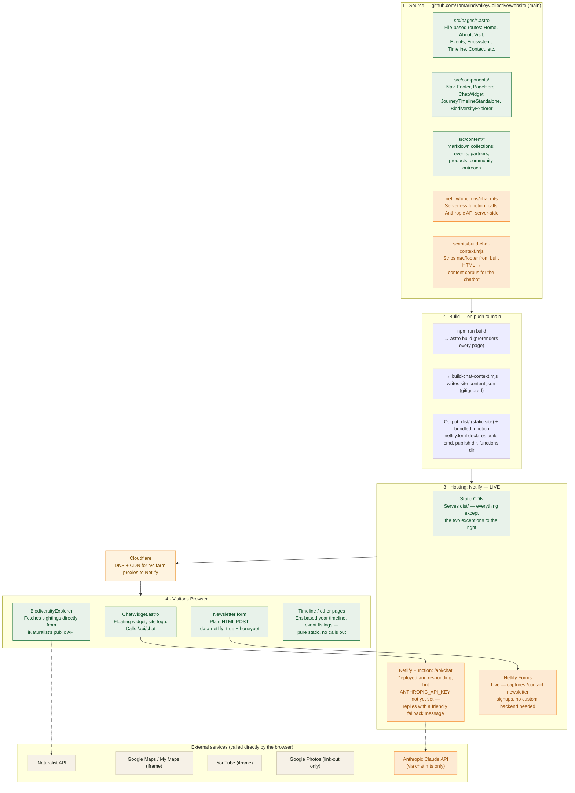

# Website Architecture

> **Keep this file up to date.** Whenever a change affects hosting, data flow, external
> services, or how a page/feature is served (new integration, new serverless function, moving
> off Netlify, etc.), update the diagram and the relevant section below in the same change.
> See the note in `AGENTS.md`.

## Overview

**tvc.farm is live**, running this Astro rebuild on Netlify (behind Cloudflare for DNS/CDN).
The site is almost entirely static (prerendered HTML/CSS/JS, no server at request time), with
two deliberate exceptions that need a small serverless backend: the site-wide chat assistant
and the newsletter signup form. Both are deployed; see
[Current Production Status](#current-production-status) — the chat assistant just needs its
API key set to give real answers.

## Diagram

**Legend:** 🟢 static / no server required · 🟠 depends on Netlify specifically (Functions or
Forms) · ⬜ external third-party service · 🟡 Cloudflare (DNS/CDN layer in front of Netlify).

## Layer-by-layer detail

### 1. Source (GitHub)

- **`src/pages/*.astro`** — file-based routes for every page: Home, About, Visit, Events,
  Ecosystem, Timeline, Contact, and their sub-pages.
- **`src/components/`** — shared UI: Nav, Footer, PageHero, the ChatWidget, the year-by-year
  `JourneyTimelineStandalone` component, and the live `BiodiversityExplorer`.
- **`src/content/`** — Markdown content collections that change over time without touching
  code: `events`, `partners`, `products`, `community-outreach`.
- **`netlify/functions/chat.mts`** — the one serverless function, powering the chat widget.
- **`scripts/build-chat-context.mjs`** — post-build script that prepares the chat widget's
  knowledge base.

### 2. Build

On every push to `main`, Netlify runs:

1. `astro build` — prerenders every route to static HTML into `dist/`.
2. `build-chat-context.mjs` — strips repeated Nav/Footer markup out of the built HTML and
   writes the remaining page text into a single JSON corpus (`site-content.json`, regenerated
   every build, gitignored).

`netlify.toml` declares the build command, publish directory (`dist`), and functions directory
(`netlify/functions`).

### 3. Hosting — Netlify (live)

- **Static CDN** — serves every prerendered page directly; the large majority of the site
  needs nothing more than this. Confirmed live via response headers
  (`cache-status: "Netlify Edge"`, `x-nf-request-id`).
- **Netlify Function** — `chat.mts` is deployed and responding at `/api/chat`, but the
  `ANTHROPIC_API_KEY` environment variable has not been set in the Netlify dashboard yet, so it
  currently replies with a friendly "not configured yet" message instead of a real answer. Once
  the key is set, no further deploy is needed — the function will pick it up immediately.
- **Netlify Forms** — live. Detects the newsletter signup form at build time
  (`data-netlify="true"`) and captures submissions with no custom backend code required;
  confirmed live at `/contact`, redirecting to `/contact/thanks` on success.

### Cloudflare (in front of Netlify)

`tvc.farm`'s DNS resolves through Cloudflare, which proxies requests to Netlify (visible via
the `server: cloudflare` header alongside Netlify's own `x-nf-request-id`). This is a DNS/CDN
layer only, not an application host — Netlify remains the origin serving the actual site and
function.

### 4. Visitor's Browser

- **ChatWidget** — floating widget using the site logo; sends the visitor's question to
  `/api/chat`. Live, but see the Netlify Function note above.
- **Newsletter form** — live. Plain HTML form submission with a spam honeypot field,
  redirecting to a confirmation page on success.
- **BiodiversityExplorer** — fetches live biodiversity sightings directly from iNaturalist's
  public API on every page load; no TVC backend involved.
- **Timeline and other pages** — the era-based year-by-year story, event listings, and the
  rest of the site are pure static content with no external calls.
- A few pages also embed third-party content directly: Google Maps/My Maps (directions and
  farm layout), YouTube (aerial drone flyover), and a link out to a community-maintained
  Google Photos album (which can't be embedded — that service sends its own
  `X-Frame-Options: SAMEORIGIN` header).

## Current Production Status

**tvc.farm is live on this codebase**, verified directly against the production site:

| Feature | Status |
|---|---|
| Static pages (Home, About, Visit, Events, Ecosystem, Timeline, etc.) | ✅ Live |
| Corrected link-preview images (WhatsApp/iMessage OG fix) | ✅ Live |
| Member list fix (Shataparna & Deb removed) | ✅ Live |
| Year-by-year interactive timeline (`/timeline`) | ✅ Live |
| Chat widget UI | ✅ Live |
| Chat widget's actual AI responses | ⚠️ Deployed, but `ANTHROPIC_API_KEY` isn't set yet — needs to be added in Netlify's dashboard (Site settings → Environment variables) |
| Newsletter signup (Netlify Forms) | ✅ Live — confirmed at `/contact`, with `/contact/thanks` as the confirmation page |

The one remaining gap: set `ANTHROPIC_API_KEY` in Netlify's environment variables to activate
real chat responses. No further deploy needed once it's set — the function picks it up
immediately.
