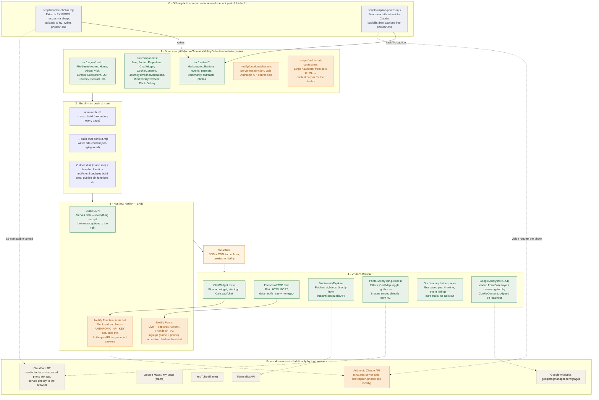

# Website Architecture

> **Keep this file up to date.** Whenever a change affects hosting, data flow, external
> services, or how a page/feature is served (new integration, new serverless function, moving
> off Netlify, etc.), update the diagram and the relevant section below in the same change.
> See the note in `AGENTS.md`.

## Overview

**tvc.farm is live**, running this Astro rebuild on Netlify (behind Cloudflare for DNS/CDN),
under the Netlify account owned by `contact@tvc.farm` (ownership moved there from a personal
account on 2026-07-18). The site is almost entirely static (prerendered HTML/CSS/JS, no server
at request time), with two deliberate exceptions that need a small serverless backend: the
site-wide chat assistant and the Friends of TVC signup form. Both are fully live; see
[Current Production Status](#current-production-status) — the chat assistant's
`ANTHROPIC_API_KEY` was set on 2026-07-18, and it now answers with real, grounded responses.

## Diagram

**Legend:** 🟢 static / no server required · 🟠 depends on Netlify specifically (Functions or
Forms) · ⬜ external third-party service (includes R2, which is a Cloudflare product but plays
the role of an external media store here, not part of the Netlify hosting path) · 🟡 Cloudflare
DNS/CDN layer in front of Netlify · ⚪ runs locally on a contributor's machine, outside the
Netlify build (the offline photo curation and captioning scripts).

## Layer-by-layer detail

### 1. Source (GitHub)

- **`src/pages/*.astro`** — file-based routes for every page: Home, About, Visit, Events,
  Ecosystem, Our Journey, Contact, In Pictures, and their sub-pages.
- **`src/components/`** — shared UI: Nav, Footer, PageHero, the ChatWidget, the year-by-year
  `JourneyTimelineStandalone` component, the live `BiodiversityExplorer`, and `PhotoGallery`
  (In Pictures - filters, Grid/Map toggle, lightbox; its map, `photo-map.ts`, reuses the same
  Leaflet + OpenStreetMap setup as the biodiversity map, adapted for photo-thumbnail pins).
- **`src/content/`** — Markdown content collections that change over time without touching
  code: `events`, `partners`, `community-outreach`, `photos` (the last one populated by the
  offline curation script below, not authored by hand).
- **`netlify/functions/chat.mts`** — the one serverless function, powering the chat widget.
- **`scripts/build-chat-context.mjs`** — post-build script that prepares the chat widget's
  knowledge base.
- **`scripts/curate-photos.mjs`** — run locally, not part of the Netlify build. Reads a folder
  of already-selected photos, extracts EXIF/GPS, uploads a display and thumbnail size of each to
  Cloudflare R2, and writes one `src/content/photos/*.md` entry per photo.
- **`scripts/caption-photos.mjs`** — also run locally. Backfills a draft `caption:` for any
  `photos/*.md` entry still carrying the filename-derived placeholder, by sending that photo's
  thumbnail to the Anthropic API (vision) and writing back a short literal description. Drafts
  are meant to be reviewed/rewritten by hand before publishing, not used as final copy.

### 2. Build

On every push to `main`, Netlify runs:

1. `astro build` — prerenders every route to static HTML into `dist/`.
2. `build-chat-context.mjs` — strips repeated Nav/Footer markup out of the built HTML and
   writes the remaining page text into a single JSON corpus (`site-content.json`, regenerated
   every build, gitignored).

`netlify.toml` declares the build command, publish directory (`dist`), and functions directory
(`netlify/functions`).

### 3. Hosting — Netlify (live)

The Netlify project is owned by the `contact@tvc.farm` account (moved there from a personal
account on 2026-07-18).

- **Static CDN** — serves every prerendered page directly; the large majority of the site
  needs nothing more than this. Confirmed live via response headers
  (`cache-status: "Netlify Edge"`, `x-nf-request-id`).
- **Netlify Function** — `chat.mts` is deployed and live at `/api/chat`. The
  `ANTHROPIC_API_KEY` environment variable was set in the Netlify dashboard on 2026-07-18;
  verified directly against production (`POST https://tvc.farm/api/chat`) returning real,
  grounded answers sourced from the site's own content.
- **Netlify Forms** — live. Detects the Friends of TVC signup form (name + phone, collected so
  TVC can add people to the "Friends of TVC" WhatsApp group by hand) at build time
  (`data-netlify="true"`) and captures submissions with no custom backend code required;
  confirmed live at `/contact`, redirecting to `/contact/thanks` on success.

### Cloudflare (in front of Netlify)

`tvc.farm`'s DNS resolves through Cloudflare, which proxies requests to Netlify (visible via
the `server: cloudflare` header alongside Netlify's own `x-nf-request-id`). This is a DNS/CDN
layer only, not an application host — Netlify remains the origin serving the actual site and
function.

### Cloudflare R2 (curated photo storage)

Separate from the above — same Cloudflare account, different product. The `tvc-photos` R2
bucket holds the display and thumbnail JPEGs `scripts/curate-photos.mjs` uploads, served
publicly at `media.tvc.farm` (a custom domain connected directly to the bucket, so it's on
Cloudflare's edge like the rest of the site, just not proxied through Netlify). The site never
talks to R2's API — pages just embed the public `media.tvc.farm/...` URLs the curation script
already baked into each photo's content-collection entry, the same way any other static image
URL works. No Netlify environment variable is involved; the upload credentials only ever need
to exist on whichever machine runs the curation script.

`scripts/caption-photos.mjs` calls the Anthropic API directly from the same local machine (using
the same `ANTHROPIC_API_KEY` that `netlify dev` uses for local chat-widget testing) to draft
captions — this is unrelated to R2, just another offline step in the same curation workflow, and
never touches Netlify either.

### 4. Visitor's Browser

- **ChatWidget** — floating widget using the site logo; sends the visitor's question to
  `/api/chat` and gets back a real, grounded answer.
- **Friends of TVC form** — live. Collects name + phone number (no email/newsletter — signups
  are added to the "Friends of TVC" WhatsApp group by hand). Plain HTML form submission with a
  spam honeypot field, redirecting to a confirmation page on success.
- **BiodiversityExplorer** — fetches live biodiversity sightings directly from iNaturalist's
  public API on every page load; no TVC backend involved.
- **PhotoGallery** (`/in-pictures`) — date/camera filter chips and a Grid/Map view toggle over
  the `photos` content collection (server-rendered, no fetch involved); photo files themselves
  load directly from `media.tvc.farm` (R2). The Map view and the lightbox's per-photo mini map
  both use the same Leaflet + OpenStreetMap tiles as the biodiversity map.
- **Our Journey timeline and other pages** — the era-based year-by-year story, event listings,
  and the rest of the site are pure static content with no external calls.
- A few pages also embed third-party content directly: Google Maps/My Maps (directions and
  farm layout) and YouTube (aerial drone flyover).
- **Google Analytics (GA4)** — loaded from `BaseLayout.astro`, so the loader is on every page
  site-wide; not tied to any one component. Measurement ID `G-795FTPB47P`. Skips loading
  entirely when `location.hostname` is `localhost`/`127.0.0.1`, so local dev browsing never
  pollutes production traffic data. Consent-gated: the loader only exposes
  `window.tvcAnalytics.load()`/`.revoke()` and does nothing on its own — `CookieConsent.astro`
  (rendered site-wide from `BaseLayout`) shows a banner on first visit and only calls `.load()`
  after the visitor accepts, storing the choice in `localStorage` (`tvc-cookie-consent`) so it
  isn't asked again. Rejecting, or later withdrawing via the footer's "Cookie preferences"
  link, calls `.revoke()`, which sets gtag's own `ga-disable-<id>` flag — the standard kill
  switch, needed because a script already injected earlier in the session can't be
  un-injected. `/privacy` documents what's collected and links back to this same control.

## Current Production Status

**tvc.farm is live on this codebase**, verified directly against the production site:

| Feature | Status |
|---|---|
| Static pages (Home, About, Visit, Events, Ecosystem, Our Journey, etc.) | ✅ Live |
| Corrected link-preview images (WhatsApp/iMessage OG fix) | ✅ Live |
| Member list fix (Shataparna & Deb removed) | ✅ Live |
| Year-by-year interactive timeline (`/our-journey/timeline`) | ✅ Live |
| Chat widget UI | ✅ Live |
| Chat widget's actual AI responses | ✅ Live — `ANTHROPIC_API_KEY` set 2026-07-18; verified with real requests against `tvc.farm/api/chat` returning grounded answers |
| Friends of TVC signup (Netlify Forms) | ✅ Live — confirmed at `/contact`, with `/contact/thanks` as the confirmation page |
| Google Analytics (GA4) | ✅ Live — `G-795FTPB47P`, loaded site-wide from `BaseLayout.astro`, skipped on localhost, consent-gated via `CookieConsent.astro` and `/privacy` |

No known gaps — every feature above is confirmed live in production. The Netlify project itself
is owned by the `contact@tvc.farm` account (moved there from a personal account on 2026-07-18).
