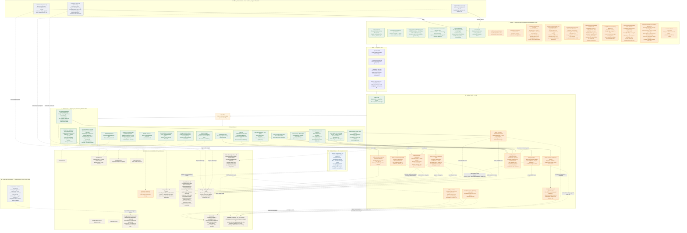

# Website Architecture

> **Keep this file up to date.** Whenever a change affects hosting, data flow, external
> services, or how a page/feature is served (new integration, new serverless function, moving
> off Netlify, etc.), update the diagram and the relevant section below in the same change.
> See the note in `AGENTS.md`.

## Overview

**tvc.farm is live**, running this Astro rebuild on Netlify (behind Cloudflare for DNS/CDN),
under the Netlify account owned by `contact@tvc.farm` (ownership moved there from a personal
account on 2026-07-18). The site is almost entirely static (prerendered HTML/CSS/JS, no server
at request time), with a small set of deliberate exceptions that need a serverless backend:
ten Netlify Functions (the site-wide chat assistant, the event-interest counter backing past
events' "Want this to happen again?" widget, `/api/photo-pool` backing the internal, unlinked
photo review dashboard at `/internal/photo-pool`, `/api/enquiry` logging the membership
enquiry form (`/join`) and the general enquiry form (`/contact`) to Google Sheets,
`/api/rainfall` reading the community's rainfall-log Google Sheet live for the rainfall chart/
table/monsoon stat on `/ecosystem/weather`, `/api/whatsapp-webhook` receiving WhatsApp Cloud
API events — see `WHATSAPP.md`, `/api/whatsapp-admin` backing the internal, unlinked
WhatsApp reply dashboard at `/internal/whatsapp`, a scheduled (cron, no HTTP path)
`whatsapp-stale-alert.mts` emailing an hourly digest of unread WhatsApp messages, and
`/api/accommodation-admin` backing the internal, unlinked tent-booking dashboard at
`/internal/accommodation-calendar` — the public, aggregate-only availability view this admin
tool was originally built alongside was deliberately **not** shipped to production with it
(dropped 2026-08-30, approach TBD)), Netlify Blobs
(public storage for the event-interest counter — the site's only *readable* server-side state
that isn't gated behind a secret; everything else below is either write-only or, for photo-pool,
gated), and Netlify Forms (the membership enquiry form on `/join`, the general enquiry form on
`/contact`, the Host an Event inquiry, the shared Visit inquiry form on the camping/day-visit/
trekking pages, and — when an email is given — the event-interest widget).
The old Friends of TVC signup form (name + phone, added to the WhatsApp group by hand) has been
replaced by a direct invite link to that same group — no form, no manual step. See
[Current Production Status](#current-production-status) — the chat assistant's
`ANTHROPIC_API_KEY` was set on 2026-07-18, and it now answers with real, grounded responses,
`/api/event-interest` responds live in production, and `/api/photo-pool`'s Google Cloud service
account, Drive folder tree, and Netlify env vars (all deploy contexts, including production) are
fully configured and **verified directly against production** (`/internal/photo-pool` returns
200, `/api/photo-pool` returns 401 unauthenticated as expected for its Google Sign-In gate).
`/api/enquiry` is **live and verified**: its two Google Sheets
are created, shared Editor-access with the service account, and their ids set as
`MEMBERSHIP_ENQUIRY_SHEET_ID`/`GENERAL_ENQUIRY_SHEET_ID` — a direct `POST` to
`https://tvc.farm/api/enquiry` for each form type appended a real row successfully. Email
notification for this form and every other form without its own override runs through one
site-wide "Email notification" rule (Site configuration → Forms → Form notifications, no
per-form `form_name` set), pointed at `core-team@tvc.farm` (moved from `contact@tvc.farm` on
2026-08-19 — see the Forms/WhatsApp section below).

## Diagram

```mermaid
flowchart TD
    subgraph CURATE["0 · Offline photo curation — local machine, not part of the build"]
        SCRIPT_PULL["scripts/pull-approved-photos.mjs<br/>Downloads Drive 'Approved' folder locally,<br/>writes a caption sidecar per curator description,<br/>moves each file to 'Published' after download"]
        SCRIPT_CURATE["scripts/curate-photos.mjs<br/>Extracts EXIF/GPS, converts HEIC via heic-convert,<br/>resizes via sharp, uploads to R2, writes photos/*.md"]
        SCRIPT_CAPTION["scripts/caption-photos.mjs<br/>Sends each thumbnail to Claude,<br/>backfills draft captions into photos/*.md"]
    end

    subgraph SEOTOOLS["0b · Local SEO maintenance — local machine, not part of the build"]
        SCRIPT_GSC["scripts/check-search-console.mjs<br/>Looks up Google's own crawl/index status<br/>(coverageState, last crawl time) for one<br/>or more URLs — e.g. to confirm a<br/>netlify.toml redirect fix has been recrawled"]
    end

    subgraph CIACTIONS["0c · GitHub Actions — CI, on push to main"]
        GHA_MEMBER["member-update-email.yml<br/>+ send-member-update-email.mjs<br/>On push touching src/data/members.ts:<br/>diffs it, classifies changed cards<br/>new/updated, emails members@tvc.farm,<br/>BCCing each changed member's own address"]
    end

    subgraph SRC["1 · Source — github.com/TamarindValleyCollective/website (main)"]
        PAGES["src/pages/*.astro<br/>File-based routes: Home, About, Visit,<br/>Events, Ecosystem, Our Journey, Contact, etc."]
        INTERNALPAGE["src/pages/internal/photo-pool.astro<br/>Unlinked, noindex — photo review dashboard shell"]
        INTERNALPAGE2["src/pages/internal/whatsapp.astro<br/>Unlinked, noindex — WhatsApp reply dashboard shell,<br/>two-pane chat UI, 15s visibility-gated polling"]
        INTERNALPAGE3["src/pages/internal/accommodation-calendar.astro<br/>Unlinked, noindex — tent-booking dashboard shell,<br/>day/week/month calendar, guest directory, audit log"]
        COMPONENTS["src/components/<br/>Nav, Footer, PageHero, ChatWidget,<br/>CookieConsent, JourneyTimelineStandalone,<br/>BiodiversityExplorer, PhotoGallery"]
        CONTENT["src/content/*<br/>Markdown collections: events, partners,<br/>community-outreach, photos"]
        FUNC_SRC["netlify/functions/chat.mts<br/>Serverless function, calls Anthropic API server-side"]
        FUNC_SRC2["netlify/functions/event-interest.mts<br/>Serverless function, reads/writes Netlify Blobs"]
        FUNC_SRC3["netlify/functions/photo-pool.mts<br/>Serverless function, Google Sign-In gated —<br/>verifies ID token, checks a Sheet-backed<br/>allow-list, lists Inbox (+ uploader/EXIF/GPS/<br/>description), moves photos, saves descriptions"]
        FUNC_SRC4["netlify/functions/enquiry.mts<br/>Serverless function — appends a row to a<br/>Google Sheet per membership/general enquiry,<br/>fired via sendBeacon alongside each form's<br/>own native Netlify Forms submission"]
        FUNC_SRC5["netlify/functions/rainfall.mts<br/>Serverless function — reads the community's<br/>rainfall-log Sheet (monthly + daily tabs) on<br/>every page view, computes the monsoon<br/>to-date stat, returns JSON"]
        FUNC_SRC6["netlify/functions/whatsapp-webhook.mts<br/>Serverless function — verifies Meta's GET<br/>handshake and each POST's HMAC signature,<br/>persists to Supabase per incoming WhatsApp<br/>message (no inbox exists for Cloud API<br/>numbers otherwise)"]
        FUNC_SRC7["netlify/functions/whatsapp-admin.mts<br/>Serverless function, Google Sign-In gated —<br/>lists conversations/messages from Supabase,<br/>sends replies via Meta's Send Message API"]
        FUNC_SRC8["netlify/functions/whatsapp-stale-alert.mts<br/>Scheduled function (cron, every 15 min) —<br/>emails core-team@tvc.farm one digest of<br/>WhatsApp conversations unread 60+ min,<br/>re-sent hourly per conversation until read"]
        FUNC_SRC9["netlify/functions/accommodation-admin.mts<br/>Serverless function, Google Sign-In gated —<br/>full tent-booking CRUD backed by Postgres<br/>(EXCLUDE constraints make double-booking<br/>physically impossible), guest directory,<br/>full audit log, past-booking justification"]
        SCRIPT_SRC["scripts/build-chat-context.mjs<br/>Strips nav/footer from built HTML →<br/>content corpus for the chatbot"]
    end

    subgraph BUILD["2 · Build — on push to main"]
        B1["npm run build<br/>→ astro build (prerenders every page)"]
        B2["→ build-chat-context.mjs<br/>writes site-content.json (gitignored)"]
        B2B["→ pagefind --site dist<br/>indexes data-pagefind-body content on every<br/>non-noindex page → dist/pagefind/"]
        B3["Output: dist/ (static site) + bundled function<br/>netlify.toml declares build cmd, publish dir, functions dir"]
    end

    subgraph HOST["3 · Hosting: Netlify — LIVE"]
        CDN["Static CDN<br/>Serves dist/ — everything except<br/>the exceptions to the right"]
        APIFN["Netlify Function: /api/chat<br/>Deployed and live —<br/>ANTHROPIC_API_KEY set, calls the<br/>Anthropic API for grounded answers"]
        APIFN2["Netlify Function: /api/event-interest<br/>Deployed and live —<br/>reads/writes the per-event count below"]
        APIFN3["Netlify Function: /api/photo-pool<br/>(+/thumb, +/description)<br/>Configured — Drive service account + folder IDs<br/>set as Netlify env vars for all deploy contexts"]
        APIFN4["Netlify Function: /api/enquiry<br/>Live and verified — Sheet ids set,<br/>Sheets shared Editor-access with the<br/>service account, real appends confirmed"]
        APIFN5["Netlify Function: /api/rainfall<br/>Reads the rainfall-log Sheet (view-access<br/>only, read-only path) — RAINFALL_SHEET_ID"]
        APIFN6["Netlify Function: /api/whatsapp-webhook<br/>Deployed and live — verified end-to-end<br/>with a real WhatsApp message on 2026-08-19"]
        APIFN7["Netlify Function: /api/whatsapp-admin<br/>Deployed and live — real conversations<br/>read/replied to via /internal/whatsapp"]
        APIFN8["Netlify Function: whatsapp-stale-alert<br/>Scheduled (cron), no HTTP path —<br/>deployed and live"]
        APIFN9["Netlify Function: /api/accommodation-admin<br/>Env-configured, not yet deployed —<br/>awaiting merge to main"]
        BLOBS["Netlify Blobs: 'event-interest' store<br/>One JSON record per past event id —<br/>{count, emails[]}. Reset via<br/>netlify blobs:delete event-interest &lt;id&gt;"]
        FORMS["Netlify Forms<br/>Captures /contact membership + general<br/>enquiries, /visit/host-an-event inquiries,<br/>/visit camping·day-visit·trekking inquiries,<br/>and event-interest submissions with an email"]
    end

    CF["Cloudflare<br/>DNS + CDN for tvc.farm,<br/>proxies to Netlify"]

    subgraph BROWSER["4 · Visitor's Browser"]
        CHATW["ChatWidget.astro<br/>Floating widget, site logo.<br/>Calls /api/chat"]
        SEARCH["SiteSearch.astro (in Nav)<br/>Dynamically imports /pagefind/pagefind.js once,<br/>searches full page content entirely client-side —<br/>no backend, no Function"]
        FRIENDS["Friends of TVC —<br/>direct WhatsApp group invite link,<br/>no form involved"]
        MEMBERFORM["Membership enquiry form (/join)<br/>data-netlify=true + honeypot,<br/>also sendBeacons to /api/enquiry"]
        GENERALFORM["General enquiry form (/contact)<br/>data-netlify=true + honeypot,<br/>also sendBeacons to /api/enquiry;<br/>plus a WhatsApp link to Madhavan"]
        HOSTFORM["Host an Event inquiry form<br/>Plain HTML POST,<br/>data-netlify=true + honeypot"]
        BOOKING["Visit inquiry form (camping,<br/>day-visit, trekking pages)<br/>One shared form + WhatsApp link,<br/>data-netlify=true + honeypot"]
        INTEREST["Event interest widget (past events)<br/>Reads/writes /api/event-interest;<br/>if an email is given, also POSTs<br/>into Netlify Forms"]
        BIODIV["BiodiversityExplorer<br/>Fetches sightings directly from<br/>iNaturalist's public API"]
        PHOTOS["PhotoGallery (/in-pictures)<br/>Filters, Grid/Map toggle, lightbox —<br/>images served directly from R2"]
        TIMELINE["Our Journey / other pages<br/>Era-based year timeline, event listings —<br/>pure static, no calls out"]
        GA["Google Analytics (GA4)<br/>Loaded from BaseLayout, consent-gated by<br/>CookieConsent, skipped on localhost"]
        WEATHER["WeatherWidget (/ecosystem/geography)<br/>Fetches current conditions from<br/>Open-Meteo, no API key"]
        RAINFALL["Rainfall chart/table/monsoon stat<br/>(/ecosystem/weather)<br/>Fetches /api/rainfall client-side,<br/>1hr-cached in localStorage"]
    end

    subgraph INTERNAL5["5 · Internal tool — staff-only, not part of the public site flow"]
        POOLDASH["Photo Pool dashboard (/internal/photo-pool)<br/>Google Sign-In gated client-side shell — shows uploader,<br/>EXIF/GPS, editable description; unlinked, noindex,<br/>sitemap-excluded"]
        WHATSAPPDASH["WhatsApp dashboard (/internal/whatsapp)<br/>Google Sign-In gated two-pane chat UI — conversation<br/>list + thread + reply box; unlinked, noindex,<br/>sitemap-excluded"]
        ACCOMMODATIONDASH["Accommodation Calendar (/internal/accommodation-calendar)<br/>Google Sign-In gated tent-booking dashboard —<br/>day/week/month views, guest directory + typeahead,<br/>audit log; unlinked, noindex, sitemap-excluded"]
    end

    subgraph EXTERNAL["External services (called directly by the browser)"]
        INAT["iNaturalist API"]
        GMAPS["Google Maps (iframe, directions only)"]
        YT["YouTube (iframe)"]
        ANTHROPIC["Anthropic Claude API<br/>(chat.mts server-side,<br/>and caption-photos.mjs locally)"]
        R2["Cloudflare R2<br/>media.tvc.farm — curated photo storage,<br/>served directly to the browser"]
        GTAG["Google Analytics<br/>googletagmanager.com/gtag/js"]
        METEO["Open-Meteo API<br/>Free, no key required"]
        GDRIVE["Google Drive API<br/>Shared Inbox/Approved/Rejected/Published<br/>folders — service-account auth,<br/>called server-side only (Function + local script)"]
        GSHEET["Google Sheets API<br/>Curator allow-list (read, photo-pool.mts) +<br/>membership/general enquiry logs (write,<br/>enquiry.mts) + rainfall log (read,<br/>rainfall.mts) + Members story-form<br/>responses (read + write Processed-at/Notes,<br/>check-member-story-responses.mjs) —<br/>same service account, called server-side<br/>only (Functions) or from a local script"]
        GIDTOKEN["Google Identity Services / OAuth<br/>Curator sign-in (browser) +<br/>ID token verification against<br/>Google's public JWKS (photo-pool.mts)"]
        GSC["Google Search Console API<br/>urlInspection.index.inspect — read-only,<br/>same service account (Full user on the<br/>property as of 2026-08-08),<br/>called from a local script only"]
        RESEND["Resend API<br/>Transactional email — noreply@tvc.farm,<br/>domain verified 2026-08-19,<br/>called from the GitHub Action above<br/>and whatsapp-stale-alert.mts"]
        WAMETA["Meta WhatsApp Cloud API<br/>Sends inbound message + template-status<br/>events to /api/whatsapp-webhook;<br/>receives replies from whatsapp-admin.mts;<br/>see WHATSAPP.md for setup status"]
        SUPABASE["Supabase Postgres ('TVC ERP' project)<br/>whatsapp_conversations/whatsapp_messages —<br/>service_role key, called server-side only<br/>(whatsapp-webhook.mts writes,<br/>whatsapp-admin.mts reads + writes)"]
    end

    SRC --> BUILD
    BUILD --> HOST
    HOST --> CF
    CF --> BROWSER
    BIODIV -.-> INAT
    APIFN -.-> ANTHROPIC
    PHOTOS -.-> R2
    GA -.-> GTAG
    WEATHER -.-> METEO
    RAINFALL --> APIFN5
    APIFN5 -.->|"read monthly + daily tabs"| GSHEET
    WAMETA -.->|"POST webhook events"| APIFN6
    APIFN6 -.->|"send notification email"| RESEND
    APIFN6 -.->|"upsert conversation,<br/>insert inbound message"| SUPABASE
    APIFN8 -.->|"query unread 60+ min"| SUPABASE
    APIFN8 -.->|"send digest email"| RESEND
    SCRIPT_CURATE -.->|"S3-compatible upload"| R2
    SCRIPT_CURATE -->|"writes"| CONTENT
    SCRIPT_CAPTION -.->|"vision request per photo"| ANTHROPIC
    SCRIPT_CAPTION -->|"backfills caption:"| CONTENT
    SCRIPT_PULL -.->|"download + move files"| GDRIVE
    SCRIPT_GSC -.->|"inspect URL indexing/crawl status"| GSC
    GHA_MEMBER -.->|"look up changed members' emails"| GSHEET
    GHA_MEMBER -.->|"send update email"| RESEND
    CHATW --> APIFN
    HOSTFORM --> FORMS
    BOOKING --> FORMS
    MEMBERFORM --> FORMS
    GENERALFORM --> FORMS
    MEMBERFORM -.->|"sendBeacon"| APIFN4
    GENERALFORM -.->|"sendBeacon"| APIFN4
    APIFN4 -.->|"append enquiry row"| GSHEET
    INTEREST --> APIFN2
    APIFN2 --> BLOBS
    INTEREST -.->|"only when an email is given"| FORMS
    CF --> INTERNAL5
    POOLDASH --> APIFN3
    APIFN3 -.->|"list Inbox, proxy thumbnails,<br/>move on approve/reject"| GDRIVE
    APIFN3 -.->|"read allow-list rows"| GSHEET
    APIFN3 -.->|"verify curator's ID token"| GIDTOKEN
    POOLDASH -.->|"Sign in with Google"| GIDTOKEN
    WHATSAPPDASH --> APIFN7
    APIFN7 -.->|"list/read conversations + messages"| SUPABASE
    APIFN7 -.->|"send reply"| WAMETA
    APIFN7 -.->|"read allow-list rows"| GSHEET
    APIFN7 -.->|"verify staff ID token"| GIDTOKEN
    WHATSAPPDASH -.->|"Sign in with Google"| GIDTOKEN
    ACCOMMODATIONDASH --> APIFN9
    APIFN9 -.->|"read/write bookings, guests,<br/>audit log"| SUPABASE
    APIFN9 -.->|"read allow-list rows<br/>(reuses PHOTO_POOL_ALLOWED_EMAILS_SHEET_ID)"| GSHEET
    APIFN9 -.->|"verify staff ID token"| GIDTOKEN
    ACCOMMODATIONDASH -.->|"Sign in with Google"| GIDTOKEN

    classDef staticStyle fill:#e8f2ea,stroke:#17723b,color:#0f5029
    classDef netlifyStyle fill:#fdead3,stroke:#f78520,color:#9a5310
    classDef externalStyle fill:#f6f1e7,stroke:#c9c2a8,color:#22291f
    classDef cfStyle fill:#fef3e0,stroke:#e8891c,color:#7a4a00
    classDef localStyle fill:#eef0f5,stroke:#6b7280,color:#374151
    classDef ciStyle fill:#eef4fb,stroke:#3b6ea5,color:#1c3f5f

    class PAGES,INTERNALPAGE,INTERNALPAGE2,INTERNALPAGE3,COMPONENTS,CONTENT,CHATW,SEARCH,FRIENDS,MEMBERFORM,GENERALFORM,HOSTFORM,BOOKING,INTEREST,BIODIV,PHOTOS,TIMELINE,GA,WEATHER,RAINFALL,CDN,POOLDASH,WHATSAPPDASH,ACCOMMODATIONDASH staticStyle
    class FUNC_SRC,FUNC_SRC2,FUNC_SRC3,FUNC_SRC4,FUNC_SRC5,FUNC_SRC6,FUNC_SRC7,FUNC_SRC8,FUNC_SRC9,SCRIPT_SRC,SCRIPT_SRC2,APIFN,APIFN2,APIFN3,APIFN4,APIFN5,APIFN6,APIFN7,APIFN8,APIFN9,BLOBS,FORMS,ANTHROPIC netlifyStyle
    class INAT,GMAPS,YT,R2,GTAG,METEO,GDRIVE,GSHEET,GIDTOKEN,GSC,RESEND,WAMETA,SUPABASE externalStyle
    class CF cfStyle
    class SCRIPT_CURATE,SCRIPT_CAPTION,SCRIPT_PULL,SCRIPT_GSC localStyle
    class GHA_MEMBER ciStyle
```

**Legend:** 🟢 static / no server required · 🟠 depends on Netlify specifically (Functions or
Forms) · ⬜ external third-party service (includes R2, which is a Cloudflare product but plays
the role of an external media store here, not part of the Netlify hosting path) · 🟡 Cloudflare
DNS/CDN layer in front of Netlify · ⚪ runs locally on a contributor's machine, outside the
Netlify build (the offline photo curation and captioning scripts) · 🔵 runs in GitHub Actions CI,
outside both the local machine and Netlify (the member-update-email workflow).

## Layer-by-layer detail

### 1. Source (GitHub)

- **`src/pages/*.astro`** — file-based routes for every page: Home, About, Visit, Events,
  Ecosystem, Our Journey, Contact, In Pictures, and their sub-pages.
- **`src/pages/internal/photo-pool.astro`** — unlinked, `noindex`, sitemap-excluded. A static
  page whose only content is a Google Sign-In gated client-side dashboard (see `netlify/functions/
  photo-pool.mts` below) for reviewing photos dropped into a shared Google Drive "Inbox" folder —
  each card shows the uploader (Drive's `lastModifyingUser`, falling back to `owners[0]`, since
  ownership doesn't reliably transfer across non-Workspace accounts), EXIF (camera, aperture,
  shutter speed, ISO, focal length) and GPS (linked out to Google Maps) that Drive already
  extracts server-side on upload, and an editable description saved independently of the
  Approve/Reject decision via its own "Save" action.
- **`src/pages/internal/whatsapp.astro`** — unlinked, `noindex`, sitemap-excluded. Same shell
  pattern as `photo-pool.astro` (Google Sign-In gate, `sessionStorage`-held ID token, `authedFetch`
  helper), backing a two-pane chat UI (see `netlify/functions/whatsapp-admin.mts` below): a
  conversation list on the left, the selected thread on the right with a reply box. Polls every 15
  seconds while the tab is visible (`document.visibilityState`) rather than real-time/WebSockets —
  deliberately a small internal tool.
- **`src/pages/internal/accommodation-calendar.astro`** — unlinked, `noindex`, sitemap-excluded.
  Same Google Sign-In shell pattern as `photo-pool.astro`/`whatsapp.astro`, backing the farm
  manager's tent-booking dashboard (see `netlify/functions/accommodation-admin.mts` below): a
  day/week/month calendar (day view redesigned 2026-08-30 into a wide, name-visible list per
  tent rather than a cramped single-column table), tapping a grid cell opens a booking dialog
  pre-filled with that tent/date, a guest directory with name/mobile-number typeahead, and a
  full create/update/delete audit log. Built alongside a public, aggregate-only availability
  view (`AvailabilityView.astro` + `/visit/availability`) that was **deliberately not shipped**
  with this initial production launch — dropped rather than deferred, pending a rethink of that
  approach.
- **`src/components/`** — shared UI: Nav, Footer, PageHero, the ChatWidget, the year-by-year
  `JourneyTimelineStandalone` component, the live `BiodiversityExplorer`, and `PhotoGallery`
  (In Pictures - filters, Grid/Map toggle, lightbox; its map, `photo-map.ts`, reuses the same
  Leaflet + OpenStreetMap setup as the biodiversity map, adapted for photo-thumbnail pins).
- **`src/content/`** — Markdown content collections that change over time without touching
  code: `events`, `partners`, `community-outreach`, `photos` (the last one populated by the
  offline curation script below, not authored by hand).
- **`netlify/functions/chat.mts`** — powers the chat widget. Rather than stuffing the entire
  `site-content.json` corpus into every request's system prompt (the original approach — risked
  exceeding the function's ~10s Netlify execution timeout on a prompt-cache miss, since ~28.5k
  corpus tokens plus Claude's own response time could exceed it), it runs a small keyword-overlap
  retrieval step per request (`selectRelevantPages()`) to pick a handful of relevant pages plus a
  fixed core set (home/about/visit/people), and separately matches the message against
  `src/data/members.ts` directly to inject a matched member's full record (bio/family/why-TVC/
  social) — the last three of those fields only ever render client-side from the Members page's
  popup JSON, so they're invisible to `build-chat-context.mjs`'s static-HTML scrape no matter how
  the page corpus itself is tuned.
- **`netlify/functions/event-interest.mts`** — powers the "Want this to happen again?" widget
  (Netlify Blobs, see Hosting below).
- **`netlify/functions/photo-pool.mts`** — backs `/internal/photo-pool`. Gated by real Google
  Sign-In rather than a shared password: a curator authenticates client-side via Google Identity
  Services, and this Function verifies the resulting ID token itself
  (`scripts/lib/google-id-token.mjs`) before checking the verified email against a live
  allow-list — a one-column Google Sheet (`getAllowedEmails` in `google-drive.mjs`), not a static
  env var, so adding a curator is just adding a row, no redeploy. A real Google Group wasn't an
  option since curators are a mix of Workspace and personal Gmail accounts (group-membership APIs
  only work within a Workspace domain you administer). Once authenticated and authorized, it
  lists images in the Drive "Inbox" folder (with uploader/EXIF/GPS/description), proxies their
  thumbnails, saves an edited description to a file's Drive `description` field on its own, and
  moves a file to "Approved" or "Rejected" on a curator's decision. Drive itself is the state
  machine — no database. Normalizes `imageMediaMetadata.time`, which Drive returns
  EXIF-formatted (`"2015:04:11 15:20:33"`) rather than RFC 3339 like every other Drive
  timestamp — passing it straight to `Date` silently produces "Invalid Date". Uses
  `scripts/lib/google-drive.mjs`'s hand-rolled service-account JWT auth (Node's built-in
  `crypto`, no `googleapis`/`google-auth-library` dependency) rather than a heavier client
  library, matching this repo's preference for small hand-rolled implementations for
  well-defined tasks (see `src/utils/calendar.ts`'s ICS generation).
- **`netlify/functions/enquiry.mts`** — backs the membership enquiry form (bottom of `/join`)
  and the general enquiry form (`/contact`). Each form submits natively via Netlify Forms (email
  handled by the site-wide "Email notification" rule in the Netlify dashboard, pointed at
  `core-team@tvc.farm`); this Function exists purely
  for the one thing Netlify Forms can't do on its own — logging the same enquiry as a row in a
  Google Sheet, one sheet per form type. The page fires it via `navigator.sendBeacon` alongside
  the form's own native submission (rather than intercepting/replacing it), since `sendBeacon` is
  designed to survive the page navigating away right after — unlike a plain `fetch()` in the same
  submit handler, which isn't guaranteed to complete once the browser starts navigating. Reuses
  `scripts/lib/google-drive.mjs`'s `appendSheetRow()` (added alongside this Function; widened the
  file's Sheets scope from `spreadsheets.readonly` to full `spreadsheets` since this is the first
  write path — actual access is still gated per-spreadsheet by sharing, not by the scope alone).
- **`netlify/functions/rainfall.mts`** — backs the multi-year rainfall line chart, its monthly
  table, and the "this monsoon so far" stat on `/ecosystem/weather`. That data used to be a
  hand-copied snapshot baked into `WeatherView.astro`'s frontmatter, updated by hand whenever
  someone remembered to; this Function reads the community's shared "Tvc rain data" Google Sheet
  live on every page view instead (`RAINFALL_SHEET_ID`, view-access only — this path never
  writes), so a new row logged in the Sheet shows up on the site with no code change or rebuild.
  Reads two tabs, both calendar-year-native (not agricultural-year, as they were before an
  August 2026 restructure of the Sheet — see `buildCalendarYears()`'s comments for the exact
  shape): "Rain data monthly" (one row per month, one column per plain calendar year, e.g.
  "2025") drives the chart's one-line-per-year view and its table, reshaped to null out months
  that haven't happened yet rather than guessing from blank cells (the Sheet pre-fills future
  cells with a literal "0" instead of leaving them blank, so blankness alone can't signal "not
  logged yet"). "Daily rain data" (a flat table, one row per calendar year+month, day-of-month
  columns) is what makes a fair "same stretch last year" comparison possible, summing each year
  from April 1 through today's exact date rather than comparing a partial year against another
  year's full total. Reuses `scripts/lib/google-drive.mjs`'s `getSheetValues()` (a small
  generalization of the existing single-column `getAllowedEmails()` reader into a full-grid one,
  used by both now).
- **`netlify/functions/whatsapp-webhook.mts`** — the WhatsApp Cloud API webhook endpoint (see
  `WHATSAPP.md` for the full setup checklist). Handles Meta's one-time GET verification handshake
  (`hub.mode`/`hub.verify_token`/`hub.challenge`, echoing the challenge back if the token matches
  `WHATSAPP_VERIFY_TOKEN` — an arbitrary string chosen ourselves, not a Meta-issued secret) and
  POST requests carrying real events, each verified via its `X-Hub-Signature-256` header (HMAC-
  SHA256 over the *raw* request body using `WHATSAPP_APP_SECRET`, the Meta app's own secret) before
  the payload is trusted at all — computed with Node's built-in `crypto`, no dependency added.
  Cloud API numbers have no inbox of their own (confirmed by checking every tab in WhatsApp
  Manager and Meta's own docs), so every inbound message is persisted to Supabase
  (`scripts/lib/supabase.mjs`, upserting a conversation by phone number then inserting a message
  row) so `/internal/whatsapp` below can show and reply to it. `message_template_status_update`
  events are logged only, not emailed, for now. **Live** — verified end-to-end with a real
  WhatsApp message on 2026-08-19. Used to also email `core-team@tvc.farm` on every message —
  removed 2026-08-20 in favor of `whatsapp-stale-alert.mts`'s digest below, once per-message
  emails turned out to be more clutter than signal.
- **`netlify/functions/whatsapp-admin.mts`** — backs `/internal/whatsapp`, the WhatsApp reply
  dashboard (2026-08-20). Same Google Sign-In auth pattern as `photo-pool.mts` (verifies the ID
  token, checks it against `photo-pool.mts`'s own `PHOTO_POOL_ALLOWED_EMAILS_SHEET_ID` allow-list —
  reused rather than a second Sheet, since it's the same core-team staff). Three routes: list
  conversations (optionally filtered by a `search` query param — matches contact name, phone, or
  message content via `scripts/lib/supabase.mjs`'s `searchConversations`, two REST calls merged
  client-side since PostgREST can't `OR` a top-level column condition with an inner-embedded-
  resource condition in one request), list one conversation's messages (both reading from
  Supabase), and send a reply — which calls Meta's Send Message API directly (`WHATSAPP_ACCESS_
  TOKEN` + `WHATSAPP_PHONE_NUMBER_ID`) and records the outcome as a message row, `status='failed'`
  with Meta's own error text when it's rejected (most likely WhatsApp's 24-hour customer-service-
  window rule, since no approved message templates exist yet) rather than a generic failure.
- **`netlify/functions/whatsapp-stale-alert.mts`** — scheduled function (Netlify cron,
  `config.schedule = "*/15 * * * *"`, no HTTP path). The "make sure it actually gets answered"
  safety net: queries `scripts/lib/supabase.mjs`'s `listStaleUnreadConversations` for
  conversations unread 60+ minutes and, if any exist, emails `core-team@tvc.farm` one digest
  listing all of them (contact, last-message preview, wait time) — never one email per
  conversation. Deliberately a recurring hourly nag rather than a one-shot alert: a conversation
  is re-included in the digest every hour for as long as it stays unread (tracked via
  `whatsapp_conversations.last_stale_alert_at`, reset to null on every new inbound message so
  each message gets its own full 60-minute countdown), so a single missed email can't let a
  message silently go unanswered.
- **`netlify/functions/accommodation-admin.mts`** — backs `/internal/accommodation-calendar`.
  Same Google Sign-In auth pattern as `photo-pool.mts`/`whatsapp-admin.mts` (verifies the ID
  token, checks it against `PHOTO_POOL_ALLOWED_EMAILS_SHEET_ID`'s allow-list — reused rather than
  a separate Sheet). Full booking CRUD plus guest search/history, all against the
  `accommodation_*` tables in the "TVC ERP" Supabase project via
  `scripts/lib/accommodation-db.mjs`. The core guarantee this whole feature was built around:
  double-booking a tent is *physically impossible*, not just checked for in application code — an
  `EXCLUDE USING gist` constraint on `accommodation_tent_assignments` makes an overlapping insert
  fail at the database level even under concurrent requests (replacing an earlier Netlify Blobs
  design that let two identical bookings land 38 seconds apart under Blobs' eventual consistency).
  A second `EXCLUDE` constraint does the same for a single guest being double-booked into two
  different tents on an overlapping night. Guest identity (`accommodation_people`) resolves by
  mobile number + name together, not by number alone, so two people sharing a phone number (a
  couple, for instance) don't silently overwrite each other; a full audit log
  (`accommodation_booking_audit_log`, populated by table triggers, not application code, so no
  write path can bypass it) records every create/update/delete, and editing or deleting a booking
  whose stay has already happened requires and records a reason.
- **`scripts/lib/accommodation-db.mjs`** — hand-rolled Supabase PostgREST REST client (same style
  as `supabase.mjs` below, no `@supabase/supabase-js`), the sole data-access layer for
  `accommodation-admin.mts`. Conflict-checking lives entirely in Postgres (see above) — this file
  just calls the `accommodation_create_booking`/`_update_booking`/`_delete_booking` RPCs and reads
  back the result, mapping a thrown RPC error's HTTP status (`404`/`409`/`422`, via
  `RAISE EXCEPTION ... USING ERRCODE = 'PTnnn'`) straight through. The public, guest-free
  availability view this once also backed (`listBookingsForAvailability`) was removed when that
  view was dropped from this launch (2026-08-30) — a future public view is separate, undesigned
  work.
- **`scripts/lib/supabase.mjs`** — hand-rolled Supabase PostgREST REST client (`fetch` + the
  `service_role` key, no `@supabase/supabase-js` dependency — matching this repo's preference for
  small hand-rolled clients over heavy libraries) for the `whatsapp_conversations`/
  `whatsapp_messages` tables in the "TVC ERP" Supabase project (see
  `supabase/migrations/0001_whatsapp_reply_admin.sql`). Used by `whatsapp-webhook.mts` (write) and
  `whatsapp-admin.mts` (read + write). `wa_message_id` has a partial unique index; inserts use
  `Prefer: resolution=ignore-duplicates` so a re-delivered webhook (Meta documents at-least-once
  delivery with retries) is a no-op rather than a duplicate row. Its `restHeaders()` helper (the
  `service_role` auth header builder) is also exported and reused directly by
  `accommodation-db.mjs` above — same project, same auth, no reason for a second copy.
- **`scripts/lib/google-id-token.mjs`** — verifies a Google Identity Services ID token: fetches
  and caches Google's JWKS, hardcodes the expected `RS256` algorithm (defense against
  algorithm-confusion attacks), verifies the RSA signature via Node's built-in `crypto`, and
  exact-matches `iss`/`aud`/`email_verified`. The reverse direction of `google-drive.mjs`'s JWT
  *signing* — same hand-rolled, dependency-free approach.
- **`scripts/build-chat-context.mjs`** — post-build script that prepares the chat widget's
  knowledge base.
- **Pagefind** (`pagefind --site dist`, run as the last step of `npm run build`) — indexes the
  client-side site search (`src/components/SiteSearch.astro`, rendered from `Nav.astro`). Its CLI
  crawls `dist/` after `astro build`, indexing only elements marked `data-pagefind-body` — just
  `BaseLayout.astro`'s `<main>`, and only when the page isn't `noindex` (that prop maps to
  `data-pagefind-body={noindex ? undefined : true}`; note it must be `undefined`, not `false` —
  Pagefind checks the attribute's *presence*, and `data-*` isn't in Astro's known-boolean-attribute
  list, so a literal `false` still serializes as `data-pagefind-body="false"` and gets indexed
  anyway). Output is a static, chunked index at `dist/pagefind/` — not a Function — that
  `SiteSearch.astro` dynamically imports (`/pagefind/pagefind.js`) once on first open and searches
  entirely in the browser/a web worker, full page content included (not just title/description),
  with no backend at all. Multilingual out of the box: it reads each page's `<html lang>` and
  scopes results to the visitor's current locale automatically.
- **`scripts/curate-photos.mjs`** — run locally, not part of the Netlify build. Reads a folder
  of already-selected photos, extracts EXIF/GPS, uploads a display and thumbnail size of each to
  Cloudflare R2, and writes one `src/content/photos/*.md` entry per photo — still just expects an
  "already hand-picked" local folder, wherever that folder came from (by hand, or via
  `pull-approved-photos.mjs` below). Handles HEIC/HEIF (iPhone photos): `exifr`'s EXIF extraction
  is format-agnostic and needed no changes, but `sharp`'s bundled libheif rejects most real
  iPhone photos outright (`Security limit exceeded: Number of references in iref box` — modern
  iPhones attach enough auxiliary images, thumbnail/depth map/portrait/HDR data, to trip a
  hard-coded libheif limit sharp doesn't expose a way to raise), so HEIC input is decoded to a
  JPEG buffer via `heic-convert` (a WASM libheif build with no such limit) before sharp ever sees
  it. Also picks up a curator-written caption: if a photo has a sibling `<filename>.caption.txt`
  (written by `pull-approved-photos.mjs`), its contents become the real caption instead of the
  usual filename-derived placeholder.
- **`scripts/caption-photos.mjs`** — also run locally. Backfills a draft `caption:` for any
  `photos/*.md` entry still carrying the filename-derived placeholder, by sending that photo's
  thumbnail to the Anthropic API (vision) and writing back a short literal description. Drafts
  are meant to be reviewed/rewritten by hand before publishing, not used as final copy.
- **`scripts/pull-approved-photos.mjs`** — run locally. Downloads everything a curator approved
  via `/internal/photo-pool` (Drive's "Approved" folder) into a local folder, writing a
  `<filename>.caption.txt` sidecar alongside any photo whose Drive `description` field was
  filled in during review, then moving each file to "Published" in Drive right after its own
  download succeeds. Prints a reminder to run `curate-photos.mjs` against that folder next —
  never invokes it itself.
- **`scripts/lib/google-drive.mjs`** — shared Drive REST client (auth, list, get, move, download)
  plus Sheets read (`getAllowedEmails`) and write (`appendSheetRow`), used by `photo-pool.mts`,
  `pull-approved-photos.mjs`, and `enquiry.mts`. Plain ESM, not TypeScript, so both a bundled
  Netlify Function and a plain `node`-run script can import it directly. Also exports three
  Search Console functions, all read-only scope, used only by the two scripts below — same
  service account, no separate credentials: `inspectUrl()` (`urlInspection.index.inspect`,
  the v1 API host) and `listSitemaps()`/`querySearchAnalytics()` (`sitemaps.list`/
  `searchAnalytics.query`, the older Webmasters v3 host — Google never migrated those two to v1).
- **`.github/workflows/member-update-email.yml`** + **`scripts/send-member-update-email.mjs`** —
  the only GitHub Action in this repo that isn't purely local/report-only (contrast
  `pagespeed.yml`). Runs on every push to `main` that touches `src/data/members.ts`, diffing that
  file's previous committed version against the new one (one member per line in this file, so a
  changed line is a changed member — no TS parsing needed) to find which member cards changed,
  classifying each as "new" (its previous line had no `whyTVC` field — the one question unique to
  the "TVC Members: Your Story" form) or "updated" (it already did; same heuristic drives a
  site-wide "N of 53 members have shared their story" progress stat in the email body). Emails
  `members@tvc.farm`, BCC'ing each changed member's own address (not CC — so members can't see
  each other's addresses) — looked up from the response
  Sheet by name via `getSheetValues()`, reusing `google-drive.mjs` and its existing
  `GDRIVE_SERVICE_ACCOUNT_EMAIL`/`_PRIVATE_KEY` (added as GitHub Actions secrets 2026-08-19,
  alongside the local `.env`/Netlify env vars that already had them) — through the **Resend**
  API (`RESEND_API_KEY` secret, `noreply@tvc.farm`, domain verified via DKIM/SPF/DMARC records
  added to the `tvc.farm` Cloudflare zone the same day). Supports a manual `workflow_dispatch`
  with `compare_ref`/`test_recipient` inputs so a real send can be tested against one inbox
  (skips the member BCCs) without emailing actual members.
- **`scripts/check-search-console.mjs`** — run locally. Looks up Google's own crawl/index status
  (`coverageState` — e.g. "Not found (404)", "Submitted and indexed" — and `lastCrawlTime`) for
  one or more URLs, to confirm whether a `netlify.toml` redirect fix has actually been recrawled
  yet rather than eyeballing the Search Console UI by hand.
- **`scripts/check-search-performance.mjs`** — run locally, `node scripts/check-search-performance.mjs
  [days]` (default 28). Reports sitemap submission/crawl status (warnings, errors, submitted vs
  indexed counts — the last of those is a known-unreliable field on the legacy endpoint, printed
  with a caveat) plus real search performance: site-wide totals and top pages/queries by clicks.
  Needs Full user, not just Restricted — see the service-account note below.

The service account was added as a Restricted user on the `tvc.farm` Search Console property
(2026-08-07), then upgraded to Full user (2026-08-08) — Restricted users can only use URL
Inspection via the API; Full also unlocks `sitemaps.list` and `searchAnalytics.query`, which
`check-search-performance.mjs` above uses.

### 1a. Localization (Kannada / Tamil)

The site is being localized into Kannada (`kn`) and Tamil (`ta`) alongside the existing English
content, using Astro's built-in i18n routing (`astro.config.mjs`'s `i18n` block: `defaultLocale:
'en'`, `locales: ['en', 'kn', 'ta']`, `routing.prefixDefaultLocale: false`). English keeps its
existing unprefixed URLs (`/about`); Kannada and Tamil live under `/kn/...` and `/ta/...`, with a
parallel `src/pages/kn/` and `src/pages/ta/` tree mirroring `src/pages/`. This is a build-time,
static-generation concern only — it doesn't add a hosting dependency or change the diagram above,
just multiplies the number of prerendered pages.

- **`src/i18n/{en,kn,ta}.ts`** — flat translation dictionaries (nav/footer/forms/cookie-banner/
  search/chat-widget/weather-widget strings, shared across many pages) plus **`src/i18n/utils.ts`**,
  which exports `useTranslations(lang)` (a `t(key, params?)` dot-path lookup with `{token}`
  interpolation, falling back to the English entry if a kn/ta key is missing), `SUPPORTED_LOCALES`,
  `DEFAULT_LOCALE`, and `stripLocalePrefix()`. Page-specific prose (the bulk of the actual
  translated copy) lives inline in each page's own view component instead, as a `content = { en,
  kn, ta }` object — see `src/components/views/AboutView.astro` for the canonical pattern.
- **`src/components/views/*View.astro`** — one per page, taking a `lang` prop; the actual
  `src/pages/**/*.astro` files (English at the bare path, plus `kn/`/`ta/` mirrors) are thin
  wrappers rendering the matching view with `lang="en"`/`"kn"`/`"ta"`.
- **`src/i18n/reviewStatus.ts`** — every kn/ta string is an initial AI-drafted pass, not
  final/reviewed copy. `TranslationNotice.astro` (rendered from `BaseLayout` whenever
  `lang !== 'en'` and that locale's `reviewStatus` flag is still `false`) shows a small banner
  saying so; flipping a locale's flag to `true` once a native speaker has reviewed everything
  removes the banner site-wide with no other code changes. See `TRANSLATIONS_REVIEW.md` for the
  reviewer's checklist.
- **`BaseLayout.astro`** sets `<html lang>`, emits `hreflang` alternate `<link>` tags (`en`/`kn`/
  `ta`/`x-default`) for every page that exists in all three locales, and accepts a `translated`
  prop (default `true`) for the handful of pages that deliberately stay English-only — `/privacy`,
  `/terms`, `/refund-policy`, and `/404` (legal boilerplate and an error page; skipped by explicit
  product decision, not an oversight) — which suppresses those alternates and points the language
  switcher at that locale's homepage instead of a nonexistent translated URL.
- **`LanguageSwitcher.astro`** (in `Nav.astro`) — a `<select>` of the 3 locales using
  `getRelativeLocaleUrl()` against the current locale-stripped path, so switching languages lands
  on the equivalent page rather than bouncing to the homepage.
- **Content collections** — `events` and `community-outreach` (which have a full markdown body)
  get sibling locale files, e.g. `src/content/events/kn/<slug>.md`, matching the English entry's
  slug so the URL stays identical across locales; `photos` and `partners` (short frontmatter
  fields only, no body) instead get optional `caption_kn`/`caption_ta` and
  `title_kn`/`excerpt_kn`/`title_ta`/`excerpt_ta` fields added directly to the existing files,
  falling back to the English field when a translation isn't filled in yet.
- **ChatWidget** — the widget sends the visitor's current `lang` alongside each message;
  `chat.mts`'s system prompt instructs Claude to reply in that language while still grounding
  itself in the (English-only) retrieved page content — no need to translate the corpus itself.

### 2. Build

On every push to `main`, Netlify runs:

1. `astro build` — prerenders every route to static HTML into `dist/`.
2. `build-chat-context.mjs` — strips repeated Nav/Footer markup out of the built HTML and
   writes the remaining page text into a single JSON corpus (`site-content.json`, regenerated
   every build, gitignored).
3. `pagefind --site dist` — the Pagefind CLI crawls the same built HTML and writes its own
   chunked, static search index under `dist/pagefind/` (not gitignored the way `site-content.json`
   is, since it needs to actually deploy as a static asset rather than staying server-side-only).

`netlify.toml` declares the build command, publish directory (`dist`), and functions directory
(`netlify/functions`).

### 3. Hosting — Netlify (live)

The Netlify project is owned by the `contact@tvc.farm` account (moved there from a personal
account on 2026-07-18).

- **Static CDN** — serves every prerendered page directly; the large majority of the site
  needs nothing more than this. Confirmed live via response headers
  (`cache-status: "Netlify Edge"`, `x-nf-request-id`).
- **`syntropic.in` / `www.syntropic.in`** — an old member-directory domain, added as a domain
  alias on this same Netlify project (2026-07-26) so its DNS zone (also managed on Netlify DNS)
  and SSL certificate resolve. `netlify.toml` force-redirects both hostnames to `tvc.farm` with
  a 301 rather than letting the alias silently mirror the site under a second hostname.
- **Netlify Functions** — five. `chat.mts` is deployed and live at `/api/chat`; the
  `ANTHROPIC_API_KEY` environment variable was set in the Netlify dashboard on 2026-07-18,
  verified directly against production (`POST https://tvc.farm/api/chat`) returning real,
  grounded answers sourced from the site's own content. `event-interest.mts` is deployed and
  live — serves `/api/event-interest`, reading/writing Netlify Blobs to back the "Want this to
  happen again?" widget on past event pages, no environment variable needed. `photo-pool.mts`
  serves `/api/photo-pool` (+`/api/photo-pool/thumb`, +`/api/photo-pool/description`) — see
  [Internal tools](#5-internal-tools) below. `GDRIVE_SERVICE_ACCOUNT_EMAIL`,
  `GDRIVE_SERVICE_ACCOUNT_PRIVATE_KEY`, `GDRIVE_INBOX_FOLDER_ID`, `GDRIVE_APPROVED_FOLDER_ID`,
  `GDRIVE_REJECTED_FOLDER_ID`, and `PHOTO_POOL_ALLOWED_EMAILS_SHEET_ID` (the curator allow-list
  Sheet's id) are all set as Netlify environment variables across every deploy context, including
  production. `PUBLIC_GOOGLE_CLIENT_ID` (the OAuth Client ID for Google Sign-In — not secret, it's
  embedded in the dashboard's client-side JS either way) is also set, but scoped to the
  **Builds** context specifically, since it needs to be present at `astro build` time or the
  compiled page permanently embeds an empty string until the next rebuild.
  `GDRIVE_SERVICE_ACCOUNT_PRIVATE_KEY` needed a separate "Local development (Netlify CLI)" value
  too, since Netlify withholds secret-scoped variables from `netlify dev`/CLI otherwise; likewise
  `PUBLIC_GOOGLE_CLIENT_ID` needs to be in the local `.env` file directly, since Netlify's env
  injection only covers `netlify dev`'s own process, not the separately-running plain `astro dev`
  server this project's `[dev]` config proxies to. Verified end-to-end via `netlify dev`,
  including a real Google Sign-In (allow-listed account → dashboard loads; removed from the
  allow-list → clean 403 "not authorized" with a "use a different account" recovery); not yet
  independently re-verified against the live production URL. `enquiry.mts` serves `/api/enquiry` —
  **live and verified**: `MEMBERSHIP_ENQUIRY_SHEET_ID` and `GENERAL_ENQUIRY_SHEET_ID` are set,
  each pointing at a Google Sheet shared Editor-access with the same `GDRIVE_SERVICE_ACCOUNT_EMAIL`
  service account photo-pool uses (view access isn't enough here, since this path writes) — a
  direct `POST` against the live production URL for each form type appended a real row.
  `rainfall.mts` serves `/api/rainfall` — reads the community's rainfall-log Sheet
  (`RAINFALL_SHEET_ID`, shared Viewer-access only, since this path never writes) live on every
  page view for the `/ecosystem/weather` chart/table/monsoon stat.
- **Netlify Blobs** — live. One store (`event-interest`), one JSON record
  per past event id (`{count, emails[]}`), written only by `event-interest.mts` — the site's
  only piece of server-side state that's publicly *readable*, unlike the write-only Forms
  below. Auto-provisioned per-site, no setup or environment variable needed. Reset a specific
  event's record with `netlify blobs:delete event-interest <event-id>` (see README.md).
- **Netlify Forms** — live. Detects each `data-netlify="true"` form at build time and captures
  submissions with no custom backend code required. Five things use it: the membership enquiry
  form (name, email, phone, message) at the bottom of `/join` and the general enquiry form (same
  fields, plus a WhatsApp link) at `/contact`, both redirecting to `/contact/thanks` on success —
  live, email notification handled by the site-wide "Email notification" rule (Site configuration
  → Forms → Form notifications) pointed at `core-team@tvc.farm` (moved from `contact@tvc.farm` on
  2026-08-19), and each also fires `/api/enquiry` (see above) to log a Sheets row; the Host an Event inquiry
  (name, org, contact details, event type, headcount, dates, message) at `/visit/host-an-event`,
  redirecting to `/visit/host-an-event/thanks` — pushed to `main` and deployed, but not
  independently re-verified against production; the Visit inquiry form
  (`src/components/BookingInquiry.astro`), one shared `visit-inquiry` Netlify Form reused on
  `/visit/camping`, `/visit/day-visit`, and `/visit/trekking-trails` with a hidden `type`
  field noting which page it came from, redirecting to `/visit/thanks` — replaces the old
  external "Book via Linger" redirect, with pricing/inclusions now published on TVC's own
  pages and a WhatsApp link offered alongside the form; pushed to `main` and deployed, with
  both email notifications (`stay@linger.in` and `core-team@tvc.farm`, the latter moved from
  `contact@tvc.farm` on 2026-08-19) set up in the
  Netlify dashboard under Site configuration → Notifications; and the
  event-interest widget's optional-email path (an AJAX POST, not a page-navigating form
  submit, only fired when a visitor gives an email) — also deployed and live. The old Friends of
  TVC signup form (name + phone, added to the WhatsApp group by hand) no longer exists — `/contact`
  now links directly to that same group's invite URL instead.

### Cloudflare (in front of Netlify)

`tvc.farm`'s DNS resolves through Cloudflare, which proxies requests to Netlify (visible via
the `server: cloudflare` header alongside Netlify's own `x-nf-request-id`). This is a DNS/CDN
layer only, not an application host — Netlify remains the origin serving the actual site and
function. `syntropic.in` (see below) does **not** go through Cloudflare at all — its DNS is
hosted directly on Netlify DNS instead. See `DOMAINS.md` for the full registrar/DNS breakdown
of both domains.

### Cloudflare R2 (curated photo storage)

Separate from the above — same Cloudflare account, different product. The `tvc-photos` R2
bucket holds the display and thumbnail JPEGs `scripts/curate-photos.mjs` uploads, served
publicly at `media.tvc.farm` (a custom domain connected directly to the bucket, so it's on
Cloudflare's edge like the rest of the site, just not proxied through Netlify). The site never
talks to R2's API — pages just embed the public `media.tvc.farm/...` URLs the curation script
already baked into each photo's content-collection entry, the same way any other static image
URL works. No Netlify environment variable is involved; the upload credentials only ever need
to exist on whichever machine runs the curation script.

`scripts/caption-photos.mjs` calls the Anthropic API directly from the same local machine (using
the same `ANTHROPIC_API_KEY` that `netlify dev` uses for local chat-widget testing) to draft
captions — this is unrelated to R2, just another offline step in the same curation workflow, and
never touches Netlify either.

### 4. Visitor's Browser

- **ChatWidget** — floating widget using the site logo; sends the visitor's question to
  `/api/chat` and gets back a real, grounded answer.
- **SiteSearch** (magnifying-glass icon in the nav, opens on click or the `/` key) — client-side
  search over every non-`noindex` page's full content, backed by Pagefind
  (`/pagefind/pagefind.js`, dynamically imported once) and matched/ranked/excerpted in the
  browser; no Function, no external service. Keyboard-navigable (↑/↓/Enter), Escape or clicking
  outside the panel closes it.
- **Friends of TVC** — live. A direct invite link to the WhatsApp group (no form, no manual
  step) — replaces the old name + phone signup that TVC had to action by hand.
- **Membership enquiry form** (bottom of `/join`, below the existing "how membership works"
  content) and **general enquiry form** (`/contact`) — live and verified end-to-end (see Hosting
  above). Each is a plain HTML form (name, email,
  optional phone, message) with a spam honeypot, submitting natively via Netlify Forms and, via
  `navigator.sendBeacon`, also logging a row to that form's own Google Sheet through
  `/api/enquiry`. The general enquiry form additionally offers a `wa.me` WhatsApp link straight
  to Madhavan, alongside the form rather than instead of it; `/join`'s form instead links back to
  `/contact` for anyone reaching out for a different reason.
- **Visit inquiry** (`/visit/camping`, `/visit/day-visit`, `/visit/trekking-trails`) — pushed
  to `main` and deployed. Each page presents its own pricing/inclusions plus a shared
  `BookingInquiry.astro` block: a plain HTML form (name, email, phone, dates, headcount,
  message, plus an itinerary picker on the Day Visit page) submitting to the same
  `visit-inquiry` Netlify Form, and a `wa.me` WhatsApp link pre-filled with a page-specific
  message. Replaces the previous external redirect to Linger's own booking pages.
- **BiodiversityExplorer** — fetches live biodiversity sightings directly from iNaturalist's
  public API on every page load; no TVC backend involved.
- **PhotoGallery** (`/in-pictures`) — date/camera filter chips and a Grid/Map view toggle over
  the `photos` content collection (server-rendered, no fetch involved); photo files themselves
  load directly from `media.tvc.farm` (R2). The Map view and the lightbox's per-photo mini map
  both use the same Leaflet + OpenStreetMap tiles as the biodiversity map.
- **The Design page's layout map** (`/about/design`) — same Leaflet + OpenStreetMap tiles,
  rendering the property boundary plus ~63 named structures/plots/zones from
  `src/data/tvc-layout.ts` (a static snapshot exported from the community's working Google My
  Maps, not a live fetch). Replaced a directly embedded Google My Maps iframe.
- **Our Journey timeline and other pages** — the era-based year-by-year story, event listings,
  and the rest of the site are pure static content with no external calls.
- A few pages also embed third-party content directly: Google Maps (directions on
  Contact/How to Reach/Visit) and YouTube (aerial drone flyover).
- **Google Analytics (GA4)** — loaded from `BaseLayout.astro`, so the loader is on every page
  site-wide; not tied to any one component. Measurement ID `G-795FTPB47P`. Skips loading
  entirely when `location.hostname` is `localhost`/`127.0.0.1`, so local dev browsing never
  pollutes production traffic data. Consent-gated: the loader only exposes
  `window.tvcAnalytics.load()`/`.revoke()` and does nothing on its own — `CookieConsent.astro`
  (rendered site-wide from `BaseLayout`) shows a banner on first visit and only calls `.load()`
  after the visitor accepts, storing the choice in `localStorage` (`tvc-cookie-consent`) so it
  isn't asked again. Rejecting, or later withdrawing via the footer's "Cookie preferences"
  link, calls `.revoke()`, which sets gtag's own `ga-disable-<id>` flag — the standard kill
  switch, needed because a script already injected earlier in the session can't be
  un-injected. `/privacy` documents what's collected and links back to this same control.
- **WeatherWidget** (`/ecosystem/geography`) — fetches current temperature/humidity/conditions
  for the farm's coordinates from Open-Meteo (free, no API key) on page load, cached in
  `localStorage` for 15 minutes. Hides itself if the fetch fails rather than showing broken UI.
- **Rainfall chart/table/monsoon stat** (`/ecosystem/weather`) — fetches `/api/rainfall`
  client-side on page load (`src/utils/rainfall.ts`, cached in `localStorage` for an hour, same
  shape as `weather.ts`'s cache), then builds a smooth multi-year SVG line chart (one line per
  calendar year with real data, Jan-Dec x-axis, a validated colorblind-safe categorical palette
  assigned by chronological order so a year keeps its color as new ones arrive), a legend that
  doubles as a year filter (checkboxes toggle a `year-hidden` class on that year's pre-built
  chart/table elements rather than re-rendering, so colors and the y-axis scale stay fixed), a
  hover/keyboard-focus crosshair + tooltip, the full monthly table, and the "this monsoon so far"
  stat — entirely in JS from the response. A short context sentence below the stat tiles (only
  shown for years with a verified external source in a small hardcoded `ENSO_CONTEXT` map, e.g.
  citing reporting on the 2026 El Niño monsoon outlook) recomputes from the same live numbers,
  so it updates whenever new rows are logged in the Sheet. Falls back to a short "data isn't
  available" message rather than a broken chart if the fetch fails.

### 5. Internal tools

- **Photo Pool dashboard** (`/internal/photo-pool`) — staff-only, not part of the public site:
  unlinked from nav, `noindex`, excluded from the sitemap. A curator signs in with their own
  Google account (Google Identity Services, an explicit "Sign in with Google" button, not the
  silent One Tap prompt) to see photos sitting in a shared Google Drive "Inbox" folder — anyone
  with edit access to that folder (staff, partners, volunteers) can drop photos in without
  needing any of this tooling themselves. The resulting ID token is stored in `sessionStorage`
  and sent as `Authorization: Bearer <token>` on every call; the server verifies it itself
  (`google-id-token.mjs`) and checks the verified email against a live allow-list — a one-column
  Google Sheet, not a static env var, so adding or removing a curator is a one-line edit, no
  redeploy. A non-allow-listed (but validly signed-in) account gets a clear "this Google account
  isn't authorized to review photos" message with a "use a different account" recovery, without
  being signed out — an expired/invalid token instead re-shows the sign-in button. Each card
  shows who uploaded it, the EXIF/GPS Drive already extracted on upload (camera, aperture,
  shutter speed, ISO, focal length, a Google Maps link for GPS), and an editable description with
  its own "Save" button, independent of the approve/reject decision — saving writes straight to
  the file's Drive `description` field. Approve/Reject buttons call `/api/photo-pool`, which moves
  the Drive file to "Approved" or "Rejected" — Drive's own folder location is the entire state
  machine, so a staffer dragging a file between folders directly in Drive's UI works exactly the
  same as clicking a button here. Real per-curator auth (rather than the shared secret this
  replaced) means an approve/reject/description-edit is attributed to an actual signed-in person,
  not "whoever had the password" — though a decision still never publishes anything to the live
  site on its own: a human still has to run `scripts/pull-approved-photos.mjs` then
  `scripts/curate-photos.mjs` and `git push` afterward. A curator's saved description becomes the
  photo's actual caption once published — see `pull-approved-photos.mjs` and `curate-photos.mjs`
  above. **Fully configured, not yet deployed**: Google Cloud service account, the four-folder
  Drive tree (Inbox/Approved/Rejected/Published, `tvc-photo-pool@tvc-farm.iam.gserviceaccount.com`
  as Editor), an OAuth 2.0 Client ID (Web application, published to Production — no verification
  needed since it only requests non-sensitive `openid`/`email`/`profile` scopes), the curator
  allow-list Sheet (shared view-only with the same service account, Sheets API enabled on the
  project), and all Netlify env vars are set up; verified end-to-end via `netlify dev`, including
  a real Google Sign-In with an allow-listed account (dashboard loads, list/thumbnail/approve/
  reject/description all functional) and the same account removed from the allow-list (clean 403
  with working recovery). Awaiting a push to `main` to actually go live.
- **WhatsApp dashboard** (`/internal/whatsapp`, 2026-08-20) — staff-only, same shape as Photo Pool
  above: unlinked, `noindex`, Google Sign-In gated, reusing the exact same curator allow-list
  Sheet. Shows every conversation persisted by `whatsapp-webhook.mts` in the "TVC ERP" Supabase
  project, oldest-inbound-message-first within a thread; sending a reply calls Meta's Send Message
  API directly and shows the result inline — a failed send (most likely the 24-hour
  customer-service-window rule, since no approved templates exist yet) is shown as a red bubble
  with WhatsApp's own error text, not silently dropped. Polls every 15 seconds while the tab is
  visible; no real-time/WebSockets, no read receipts, no message pagination beyond the newest
  200 per thread / 50 conversations — deliberately a small internal tool, not a CRM. **Built,
  awaiting `SUPABASE_SERVICE_ROLE_KEY`**: `SUPABASE_URL` and `WHATSAPP_PHONE_NUMBER_ID` are set on
  Netlify (all deploy contexts); the Supabase service-role key still needs pasting into Netlify's
  UI by hand (same secret-handling rule as `WHATSAPP_ACCESS_TOKEN`) before this can go live.
- **Accommodation Calendar** (`/internal/accommodation-calendar`) — staff-only (Madhavan, the
  farm manager), same shape as Photo Pool/WhatsApp above: unlinked, `noindex`, Google Sign-In
  gated, reusing the same allow-list Sheet (`ACCOMMODATION_ALLOWED_EMAILS_SHEET_ID`, set to the
  same Sheet id as `PHOTO_POOL_ALLOWED_EMAILS_SHEET_ID` rather than maintaining a second one).
  Records who's in which of the farm's 8 tents/huts, for how long, and why — a day/week/month
  calendar (tapping any cell opens a pre-filled booking dialog), a reusable guest directory with
  name/mobile-number typeahead and each guest's past-stay history, and a full audit trail of
  every change. The double-booking guarantee is enforced by Postgres itself (`EXCLUDE` gist
  constraints — see `accommodation-admin.mts` above), not application code, so it holds even
  under concurrent requests. Built alongside a public, aggregate-only availability page
  (`/visit/availability`) that let Linger (TVC's hospitality partner) self-serve rough
  availability instead of calling Madhavan directly — that public half was **deliberately
  dropped, not deferred**, before this launch (2026-08-30): the admin tool graduated to
  production on its own, and the public-facing approach is being rethought from scratch rather
  than shipped as originally designed.

## Current Production Status

**tvc.farm is live on this codebase**, verified directly against the production site:

| Feature | Status |
|---|---|
| Static pages (Home, About, Visit, Events, Ecosystem, Our Journey, etc.) | ✅ Live |
| Corrected link-preview images (WhatsApp/iMessage OG fix) | ✅ Live |
| Member list fix (Shataparna & Deb removed) | ✅ Live |
| Year-by-year interactive timeline (`/our-journey/timeline`) | ✅ Live |
| Chat widget UI | ✅ Live |
| Chat widget's actual AI responses | ✅ Live — `ANTHROPIC_API_KEY` set 2026-07-18; verified with real requests against `tvc.farm/api/chat` returning grounded answers |
| Friends of TVC WhatsApp group (direct invite link) | ✅ Live — `/contact` links straight to the group, no form or manual step |
| Membership + general enquiry forms (Netlify Forms + `/api/enquiry`) | ✅ Live — Sheet ids set and shared with the service account, verified with real `POST`s against production for both form types; email goes to `core-team@tvc.farm` via the site-wide Netlify Forms notification rule (moved from `contact@tvc.farm` on 2026-08-19) |
| Host an Event inquiry form (Netlify Forms) | 🟢 Deployed and registered — confirmed directly via Netlify's Forms API (`host-event-inquiry`, correct field schema: name/organization/email/phone/event-type/group-size/dates/message/honeypot); **0 submissions to date**, so the full round-trip hasn't actually been exercised yet |
| Visit inquiry form + WhatsApp CTA (Netlify Forms) | ✅ Live and verified — confirmed via Netlify's Forms API (`visit-inquiry`), **1 real submission recorded** (2026-08-04); replaces the "Book via Linger" redirect on `/visit/camping`, `/visit/day-visit`, `/visit/trekking-trails` |
| Event interest widget + counter (Netlify Function, Blobs, Forms) | ✅ Live — "Want this to happen again?" on past event pages (`/events/<slug>`), public count via `/api/event-interest` + Netlify Blobs, optional-email entries via Netlify Forms; verified `/api/event-interest` responds live in production |
| Google Analytics (GA4) | ✅ Live — `G-795FTPB47P`, loaded site-wide from `BaseLayout.astro`, skipped on localhost, consent-gated via `CookieConsent.astro` and `/privacy` |
| Live weather widget (`/ecosystem/geography`) | ✅ Live — Open-Meteo, no API key, 15-minute `localStorage` cache |
| Live rainfall chart/table/monsoon stat (`/ecosystem/weather`, `/api/rainfall`) | ✅ Live — reads the community's rainfall-log Sheet live, `RAINFALL_SHEET_ID` set on Netlify (all deploy contexts); multi-year line chart with year-filter checkboxes; verified against `tvc.farm/ecosystem/weather` and `tvc.farm/api/rainfall` directly |
| Site search (nav icon / `/` key) | 🟡 Built, verified locally (not yet deployed) — switched from a title/description-only index to Pagefind, which indexes each non-`noindex` page's full `<main>` content; confirmed via a local production build + `astro preview` that in-body content (e.g. member names on `/people/members/`) is now searchable and that `noindex` pages (404, thanks pages, `/internal/photo-pool`, `/people/members/story-guide`) are correctly excluded from the index |
| Photo Pool dashboard (`/internal/photo-pool`, `/api/photo-pool`) | ✅ Live — Drive folders, service account, Google Sign-In OAuth client, curator allow-list Sheet, all Netlify env vars configured; verified against production directly (`/internal/photo-pool` returns 200, `/api/photo-pool` returns 401 unauthenticated as expected for the Google Sign-In-gated function) |
| WhatsApp webhook (`/api/whatsapp-webhook`) | ✅ Live — verified end-to-end with a real WhatsApp message to `+91 80 4110 9754` on 2026-08-19. Two real bugs found and fixed along the way: the number wasn't actually registered for Cloud API messaging (blocked by a stuck migration from the old AiSensy WABA, which still held the number), and the WABA was never subscribed to the app's webhook (`POST /{waba-id}/subscribed_apps` — a separate step from the App Dashboard's webhook config). Persists every inbound message to Supabase (2026-08-20); no longer emails per-message (see the stale-alert row below). See `WHATSAPP.md` |
| WhatsApp reply dashboard (`/internal/whatsapp`, `/api/whatsapp-admin`) | ✅ Live — verified end-to-end with real WhatsApp messages and real replies sent from production. Unread indicators, real pagination, message previews, per-reply responder names, WhatsApp/iMessage-style avatars, and a full visual pass added 2026-08-20 after real usage surfaced gaps |
| WhatsApp unread digest (`whatsapp-stale-alert.mts`, scheduled) | ✅ Live — cron every 15 minutes, emails `core-team@tvc.farm` one digest of conversations unread 60+ minutes, re-sent hourly per conversation until read. Replaces the old per-message email (2026-08-20) |
| Accommodation Calendar dashboard (`/internal/accommodation-calendar`, `/api/accommodation-admin`) | 🟢 Built and env-configured, not yet deployed — `SUPABASE_URL`/`SUPABASE_SERVICE_ROLE_KEY`/`PUBLIC_GOOGLE_CLIENT_ID` and the newly-set `ACCOMMODATION_ALLOWED_EMAILS_SHEET_ID` are all set on Netlify for production; verified extensively via `netlify dev` including real Google Sign-In, live tent-conflict prevention, and the Postgres `EXCLUDE` constraints under direct SQL testing. Awaiting merge to `main` to go live. The public availability view (`/visit/availability`) built alongside it was **not** included in this launch — dropped 2026-08-30, pending a rethink |

The membership/general enquiry forms are fully live — Sheets logging verified with real
production `POST`s, and email routes to `core-team@tvc.farm` via the site-wide Netlify Forms
notification rule. Every feature in the table above except the one noted below has been checked
directly against production (page/API responses, or Netlify's own Forms API). The Host an Event
form is registered correctly with Netlify, but has zero real submissions to date, so its full
round-trip hasn't actually been exercised.
The Netlify project itself is owned by the `contact@tvc.farm` account (moved there from a
personal account on 2026-07-18).
